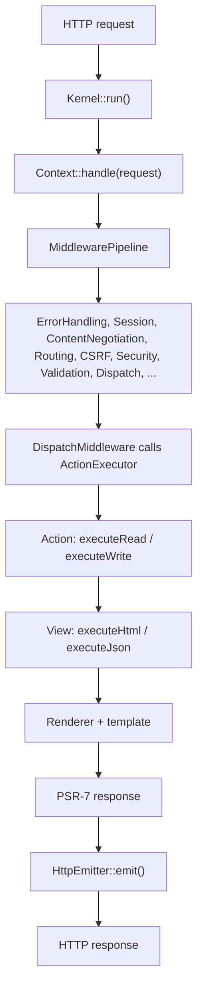

# The request lifecycle

> How a request travels from the kernel through the middleware pipeline to a rendered response.

This is the map of how Quiote turns an incoming HTTP request into a response — the single narrative that the rest of the architecture docs branch off from. Every request follows the same path: the kernel builds a PSR-7 request, hands it to the context, the context runs it through a PSR-15 middleware pipeline, and one of those middlewares dispatches an action and renders a view. Because the path is always the same, you can reason about any request by knowing these steps once.

This page traces that path end to end and names the real classes at each step. If you only read one architecture page, read this one; the others (middleware, actions and views, routing, security) zoom in on a stage described here.

## The big picture



## 1. Boot — `Quiote\Runtime\Kernel`

The front controller calls `Kernel::create([...])->run()`. `run()` does four things:

1. **Bootstrap** — sets core paths (`core.app_dir` and friends), decides whether the APCu config cache is usable, and calls `Quiote::bootstrap()` to load `settings`, create the requested context(s), and prime the controller.
2. **Select a worker runtime** — a `WorkerRuntimeInterface` (`sapi`, `frankenphp`, `roadrunner`, `swoole`, or one a plugin registered), from the kernel option, `$QUIOTE_WORKER_RUNTIME`, `core.worker_runtime`, or auto-detection. The runtime owns the request loop and both of its ends. See [Deployment](/architecture/deployment/#choosing-a-runtime).
3. **Build the request** — under a SAPI runtime, from the superglobals via Nyholm's `ServerRequestCreator::fromGlobals()`; off-SAPI, from the request object the server hands over. Either way reverse-proxy corrections (`X-Forwarded-*`) are applied and the result is wrapped in a `Quiote\Request\WebRequest` (which extends Nyholm's `ServerRequest`).
4. **Handle and emit** — for each request the shared `WorkerLoop` calls `$context->handle($request)` and the runtime's own emitter sends the response. Any exception that escapes is rendered through `ErrorHandlingMiddleware::renderExceptionResponse()`.

Under a persistent runtime, steps 1–2 happen once per worker; steps 3–4 repeat per request. State that must not leak between requests is reset via `WorkerManager::resetForNextRequest()`.

## 2. Enter the pipeline — `Context::handle()`

`Quiote\Context::handle()` is the PSR-15 entry point every runtime calls, and it delegates to `Quiote\Runtime\ContextRequestHandler` — a class that **declares** `RequestHandlerInterface` rather than merely matching its signature:

```php
public function handle(ServerRequestInterface $request): ResponseInterface
{
    return $this->getRequestHandler()->handle($request);
}
```

The handler owns the per-request work around the pipeline:

1. Adopts an inbound correlation id from the configured header when there is a sane one — an upstream gateway, a distributed trace — or generates one, and stamps it onto the request as `quiote.rid`.
2. Opens a fresh ambient logging scope for that id, so every line from this request is correlatable.
3. Arms the request-state flush (see [the request boundary](#the-request-boundary)).
4. Builds the `Quiote\Middleware\MiddlewarePipeline` on first use and reuses it for the worker's lifetime, then runs the request through it.
5. Exposes the correlation id on the response and emits `ResponseSendingEvent` — the last hook that sees the full request and response together.

Reach the pipeline with `$context->getRequestHandler()->pipeline()`. If you reconfigure `MiddlewareCatalog` after a request has been served, drop the composed pipeline with `forgetPipeline()` — it's built once and reused, so a stale one would otherwise survive the change. `Context::getCorrelationId()` reads the id from the handler.

## 3. The middleware pipeline

`MiddlewarePipeline` builds the chain once (`doBuild()`) and runs it via [Relay](https://relayphp.com/). The full ordered stack and what each middleware does is documented in [The middleware pipeline](/architecture/middleware-pipeline/). The important ones for the lifecycle:

- **SessionMiddleware** loads or creates this request's session and installs it on the context as the [session bag](/basics/sessions/), so everything downstream — the user, CSRF, application code — reaches the same session. It runs early, before security.
- **RoutingMiddleware** matches the path, resolves `_module`/`_action`, negotiates the output type, and builds an `ActionDescriptor`.
- **SecurityMiddleware** decides whether the request is allowed to run the action.
- **ValidationMiddleware** runs the action's validators and records a pass/fail decision.
- **DispatchMiddleware** actually runs the action and renders the view. It is effectively terminal.

On the way back out, `SessionMiddleware` is where request state lands: it **persists the user, then the session, then bakes the `Set-Cookie` onto the response** — all before the response is emitted in step 6. That ordering is deliberate, since the user is the only writer of roles and credentials and a write after the session has been serialized is a write nobody reads back. The consequence for your own code: anything mutating the user *below* `SessionMiddleware` in the pipeline runs after the flush and does not persist. See [Sessions: how it fits in a request](/basics/sessions/#how-it-fits-in-a-request).

## 4. Dispatch — `DispatchMiddleware` and `ActionExecutor`

`DispatchMiddleware` reads the `ActionDescriptor` from the request (404 if there isn't one) and delegates to `Quiote\Execution\ActionExecutor::execute()`. The executor:

1. **Creates the action** via `Controller::createActionInstance($module, $action)`.
2. **Initializes it** with a lightweight init context (context, module, action, method, output type, request, response) through `$action->initialize(...)`.
3. **Runs it** — `ActionResolver` picks the method from the HTTP verb (`executeRead` for GET, `executeWrite` for POST, `executeUpdate` for PUT/PATCH, `executeRemove` for DELETE, or a verb-exact method), falling back to `execute`. The return value is a view name.
4. **Snapshots attributes** the action set via `setAttribute()`.
5. **Resolves the view** — `ViewNameResolver` turns `(module, action, viewName)` into a view class, e.g. `IndexSuccessView`.
6. **Runs the view** — `selectViewMethod()` picks `execute<OutputType>()` (e.g. `executeHtml`) if it exists, else `execute()`. If the method returns null but layers were loaded, `renderLayers()` runs the templates.

The executor returns an `ActionExecutionContext` carrying the rendered content, the view identity, the attribute bag, and any redirect. See [Actions and views](/architecture/actions-and-views/) for the contract in detail.

## 5. Build the response

`DispatchMiddleware` turns the execution result into a Nyholm PSR-7 response: it applies the `http_headers` configured for the output type, bridges status/headers/cookies/redirects from the framework's `WebResponse`, and adds `X-Content-Type-Options: nosniff`.

## 6. Emit — `HttpEmitter`

Back in the kernel, `HttpEmitter::emit($response)` writes the PSR-7 response to the client. Under a persistent worker the loop then resets per-request state and waits for the next request.

Session-backed state is persisted **before** the response is emitted, not on the way out of the pipeline — so anything that mutates the user after the pipeline unwinds is not saved.

## The request boundary

`Quiote\ContextLifecycle` owns a context's per-request state machine — armed, claimed, cleared, armed again. Reach it with `Context::getLifecycle()`. It holds two things that only make sense together:

- **The state-flush claim.** Exactly one caller per request persists the session-backed state; the first to claim it wins and the rest are no-ops rather than double writes.
- **The end-of-request clears**, which drop everything that must not survive into the next request the process serves.

Identity is cleared first and unconditionally. `Context::reset()` runs the throwable-prone work — the controller reset, the user flush, the shutdown sequence that recycles database connections — inside a `try`, with the clearing of the session bag, the user and the request in the `finally`. A dead socket at a request boundary is an ordinary event, and before this the identity assignments sat *after* that work: any throwable aborted the reset before they ran, so the next request in that worker got a fresh session bag but the **previous request's authenticated user object**, roles intact. Each remaining component reset is separately guarded too, so one broken reset can't block the others.

Plugins and application code can contribute their own clears — see [Plugins: clearing your own state](/architecture/plugins/#clearing-your-own-state-at-the-end-of-a-request).

Under classic per-request PHP none of this matters; the process exits and takes everything with it. Under a [persistent worker](/architecture/deployment/) it is the whole isolation guarantee.

## Two request flavours

Not every request runs the full path:

- **Simple actions** (`isSimple()` returns true) skip execution entirely, not just validation — no `execute*()`, `validate()`, or `registerValidators()` runs, and `DispatchMiddleware` renders `getDefaultViewName()` directly. See [Actions and views](/architecture/actions-and-views/#issimple-means-no-action-code-runs-at-all).
- **Non-simple actions** require a completed validation decision before dispatch; if validation is missing, dispatch fails loudly rather than running unvalidated.

This is the safety default described in [Validation](/basics/validation/): an action that expects input does not run until that input has been validated.
